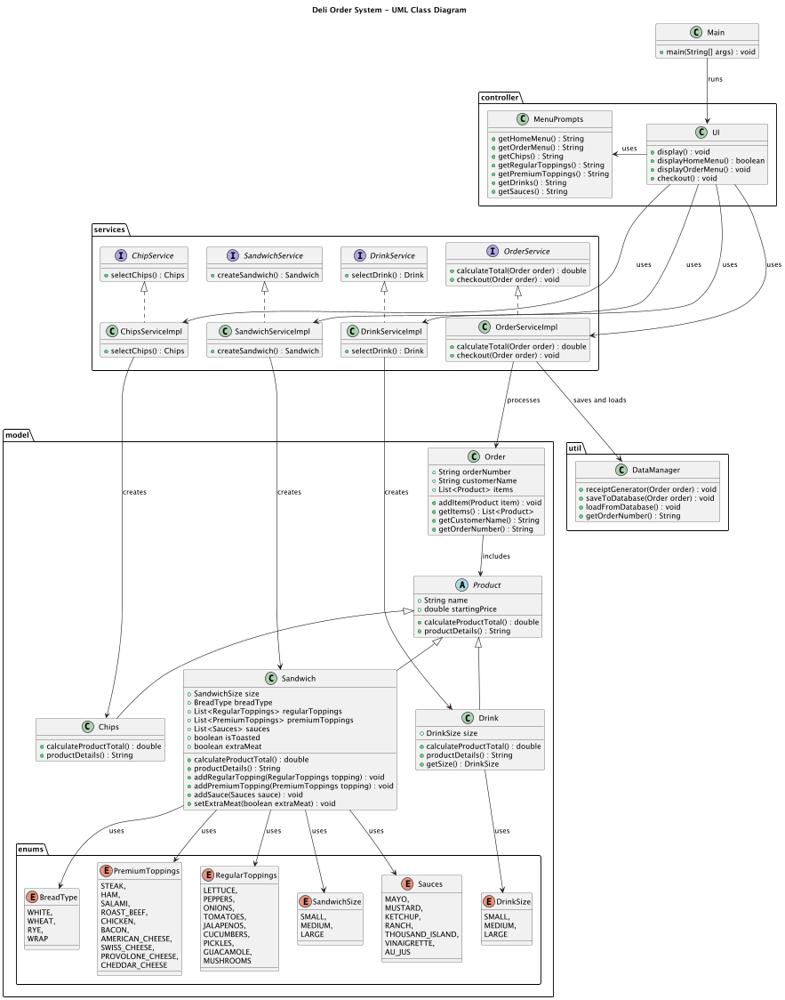

# Deli Order System

- [1: Overview](#1-overview)
- [2: Features](#2-features)
- [3: User Stories](#3-user-stories)
- [3.1: Customer Orders Signature Sandwich](#31-customer-orders-signature-sandwich)
- [3.2: Customer Orders Custom Sandwich](#32-customer-orders-custom-sandwich)
- [3.3: Customer Orders Drink](#33-customer-orders-drink)
- [3.4: Customer Orders Chips](#34-customer-orders-chips)
- [3.5: Customer Orders Multiple Items](#35-customer-orders-multiple-items)
- [4: Lessons Learned](#4-lessons-learned)


## 1: Overview
The Custom Deli POS project is a project that allows deli customers to order fully customized sandwiches, all while 
practicing Object-Oriented Programming (OOP) principles. The project exemplifies best practices in OOP concepts such as 
Separation of Concerns (SOC), DRY (Don’t Repeat Yourself), Abstraction, Inheritance, and Effective Git Branching 
Strategies. These practices create a scalable, robust system than can be easily updated as needed.

## UML Diagram


## 2: Features
- **Create Custom Sandwiches**: Users can build their own sandwiches by choosing from a variety of bread types, sizes, and toppings. The supports both regular and premium toppings, allowing for a completely customizable sandwich experience.
- **Add Chips and Drinks**: Users can add Chips and Drinks to order for an additional charge.
- **Generate and Save Receipts**: After a user chooses to check out a receipt is generated from their created order
- **Load and Save Order History**: There is a csv names transaction history that stores all transaction. This can be used in future updates to recall old transactions on admin servers

## 3: User Stories

### 3.1: Customer Orders Signature Sandwich
Title: Customer Orders Signature Sandwich
As a deli customer, I want to order a signature sandwich so that I can get a good deal and not make too many decisions.
Scenario:
```
- Given the customer is at the deli order system
- When the customer selects a signature sandwich
- Then the system should add the sandwich to the order with the correct price

```
Acceptance Criteria:
```
- The system should generate a receipt with the correct total
- The system should have two signature sandwiches: "BLT" and "Philly Cheese"
- The signature sandwiches should have predefined toppings and prices
- The customer should be able to select a signature sandwich
- The selected sandwich should be visable in the order summary
- The checkout process should include the signature sandwich with the correct price 
```

### 3.2: Customer Orders Custom Sandwich
Title: Customer Orders Custom Sandwich
As a deli customer, I want to create a custom sandwich so that I can choose exactly what I want.
Scenario:
```
- Given the customer is at the deli order system
- When the customer selects add sandwich
- Then they can choose to create a fully custom sandwich

```
Acceptance Criteria:
```
- The system should prompt the customer if they want a signature sandwich
- The system should prompt the customer to select a sandwich size
- The system should prompt the customer to select a bread type
- The system should ask the customer if they want the sandwich toasted
- The system should prompt the customer to select Premium toppings
- The system should prompt the customer to select Regular toppings
- The system should prompt the customer to select sauce
- The system should ask the customer if they want extra meat
- The systems returns to order screen and displays the custom sandwich in the order summary
- When the customer checks out
- Then the system should generate a receipt with the correct total
```

### 3.3: Customer Orders Drink
Title: Customer Orders Drink
As a deli customer, I want to order a drink because I forgot to order one with my sandwich
Scenario:
```
- Given the customer is at the deli order system
- When the customer selects add drink
- Then the system should add the drink to the order with the correct price
```
Acceptance Criteria:
```
- The system should prompt the customer to select a drink size
- The system should prompt the customer to select a drink type
- The system should add the drink to the order summary
- The system should generate a receipt with the correct total
```
### 3.4: Customer Orders Chips
Title: Customer Orders Chips
As a deli customer, I want to order chips because I am still hungry after my sandwich
Scenario:
```
- Given the customer is at the deli order system
- When the customer selects add chips
- Then the system should add the chips to the order with the correct price
```
Acceptance Criteria:
```
- The system should prompt the customer to select a chip type
- The system should add the chips to the order summary
- The system should generate a receipt with the correct total
```

### 3.5: Customer Orders Multiple Items
Title: Customer Orders Multiple Items
As a deli customer, I want to order multiple items because I am very hungry
Scenario:
```
- Given the customer is at the deli order system
- When the customer selects multiple items
- Then the system should add all items to the order with the correct prices
```
Acceptance Criteria:
```
- The system should prompt the customer to select multiple items
- The system should add all items to the order summary
- The system should generate a receipt with the correct total
```


## 4: Lessons Learned
During the development of the Deli Order System, several advanced Object-Oriented Programming (OOP) concepts were applied and reinforced:

### Inheritance
Inheritance was used to create a hierarchy of classes, allowing for code reuse and a clear structure. For example, the `Product` class serves as a base class for specific product types like `Sandwich`, `Drink`, and `Chips`.

### Overriding Methods
Method overriding was utilized to provide specific implementations of methods in subclasses. For instance, the `calculateProductTotal` and `productDetails` methods in the `Sandwich`, `Drink`, and `Chips` classes override the abstract methods defined in the `Product` class.

### Overloading Constructors
Constructor overloading was employed to provide multiple ways to instantiate objects. The `Sandwich` class, for example, has multiple constructors to accommodate different initialization scenarios, such as creating a custom sandwich or a signature sandwich with predefined toppings.

These concepts helped in creating a flexible, maintainable, and scalable codebase for the Deli Order System.